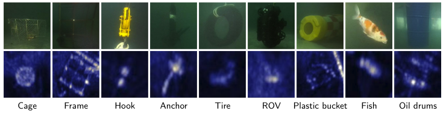

# USOI: Underwater Sonar-Optical Image Dataset

> 这是一个使用水下 ROV（Remotely Operated Vehicle）进行数据采集的声光（声纳-光学）数据集。后续会持续进行更新。

This is a **sonar-optical (acoustic-optical) dataset** collected using an **underwater ROV**. The dataset will be **continuously updated** in the future.

## Dataset Overview

Each sample consists of a paired optical image and its corresponding sonar image, with aligned bounding-box annotations for both modalities.



## Dataset Structure

```
USOI/
├── optical/        # Optical images (vis-XXXX.jpg) + labels (vis-XXXX.txt)
├── sonar/          # Sonar images (son-XXXX.jpg) + labels (son-XXXX.txt)
└── assets/         # README assets
```

- Image format: YOLO-style normalized bounding-box labels (`.txt`)
- Each pair shares the same numeric ID (e.g. `vis-0035.jpg` ↔ `son-0035.jpg`)

## Classes (9 categories)

| ID | Class |
|----|-------|
| 0 | cage |
| 1 | frame |
| 2 | hook |
| 3 | anchor |
| 4 | tire |
| 5 | rov |
| 6 | plastic bucket |
| 7 | fish |
| 8 | Oil drums |

## Updates

The dataset is under active expansion. New samples, categories, and annotations will be added over time. Please watch / star this repository for updates.
